# New Tab Flex
**Author: Oleg Barte**

### The Chronicle of Digital Absurdity
It is 2026. Tech giants have trillion-dollar budgets, yet when you 
open your browser, you see... garbage. You have been turned into a 
product. Your attention is sold before you even type a search query. 
You are forced to be a guest in your own browser.

**New Tab Flex changes the rules. We are stopping this sabotage.**
This is a manifesto. A clean space with no ads, no "smart" feeds, 
and no hidden algorithms. A completely free start page that lives 
only on your device, respecting your privacy and your right to silence.

### Key Features
- **Visual Order:** Drag and drop links, images, and stickers to 
build your ideal dashboard. Turn chaos into structure.
- **Total Customization:** You define the geometry. Adjust tile size, 
corner radius, transparency, and fonts. This is your personal 
design project.
- **Three Independent Workspaces:** Spaces A, B, and C let you 
separate work, rest, and private browsing. Each space has its own 
layout, background, and settings.
- **Absolute Privacy:** Everything runs locally and instantly. 
Your data never leaves your device. No cloud, no tracking, 
no external servers.
- **Smart Search:** Switch between Google, Yandex, and Perplexity 
with one click — without leaving the page.

### Flex Redirect — Browser Integration
New Tab Flex is a standalone HTML file that works in any desktop 
browser. To make it open automatically on every new tab, use the 
**Flex Redirect** companion extension for Chromium-based browsers 
(Chrome, Brave, Edge, Opera, Opera GX).

👉 [Get Flex Redirect on Chrome Web Store](https://chromewebstore.google.com/detail/flex-redirect/jlechbbjnfdimkgpalfknndpjjnpcjjl)

### License
This is **proprietary software** with publicly available source code. 
Published strictly for transparency and security review.
Modification, redistribution, rebranding, and commercial use are 
prohibited without the author's written permission.

Full terms: see `LICENSE` file. © Oleg Barte, 2026.

---

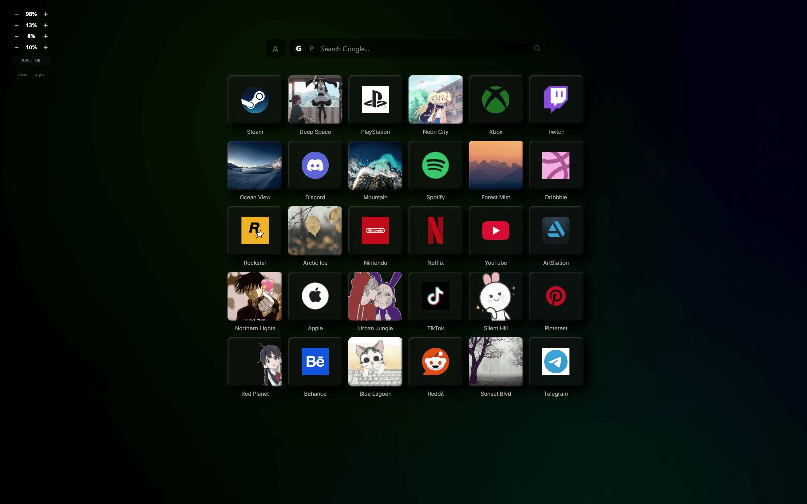
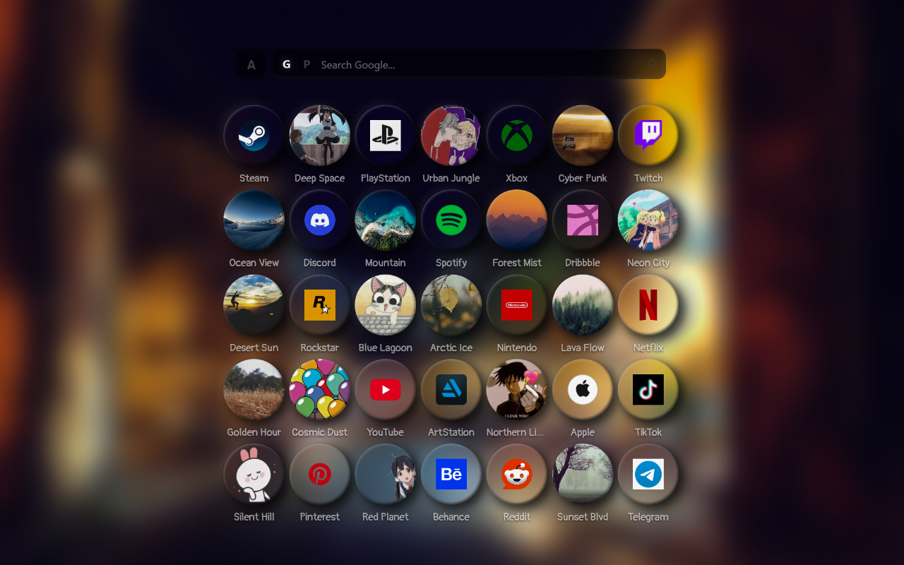
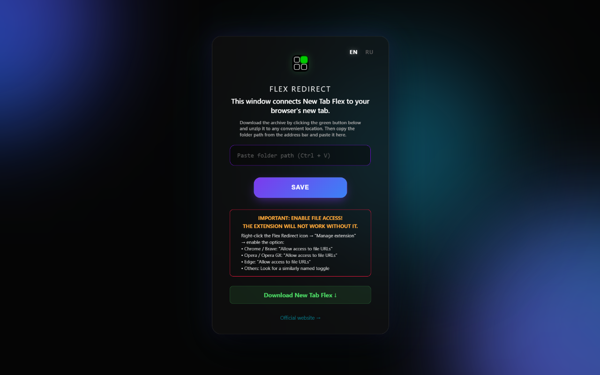
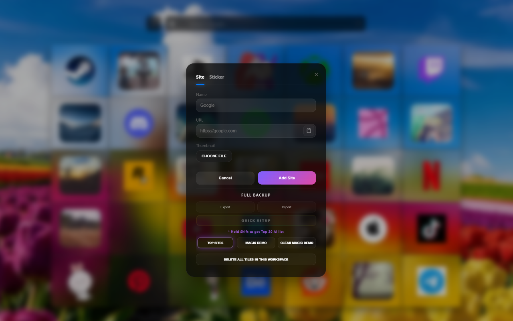
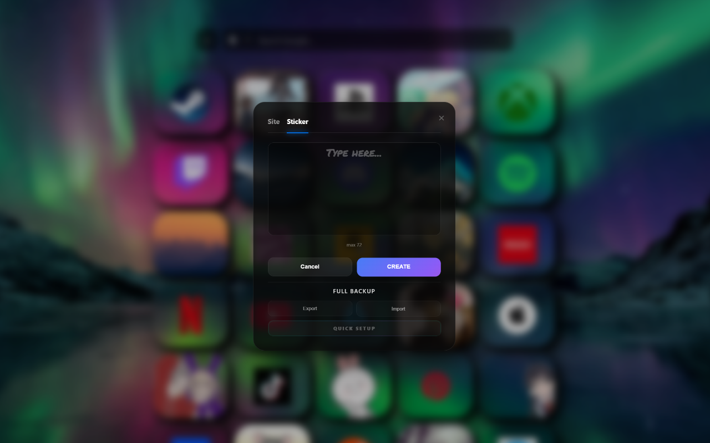
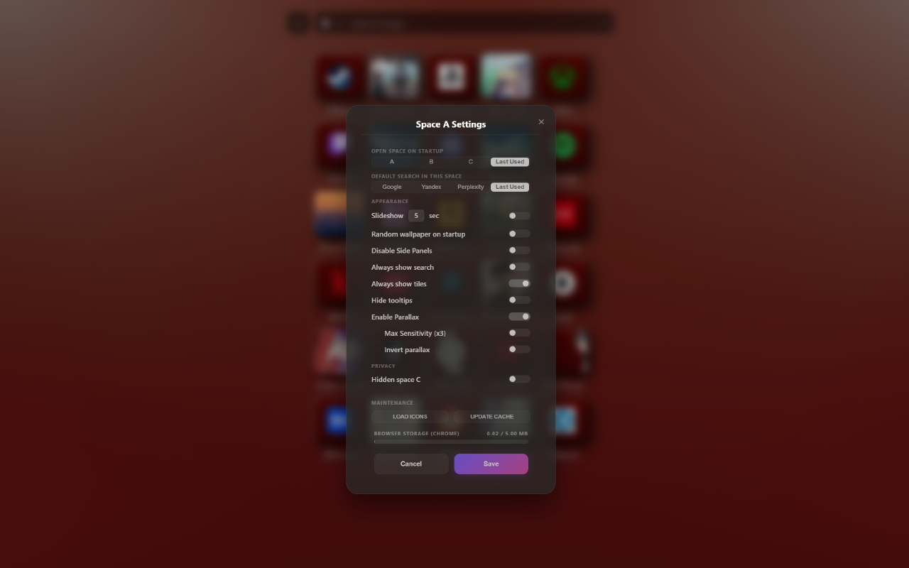
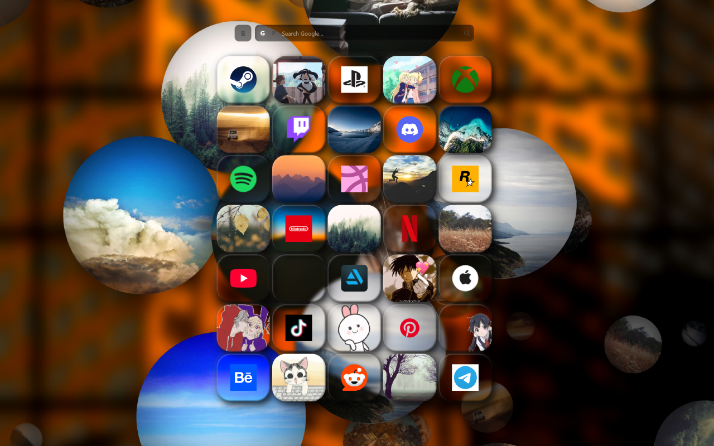
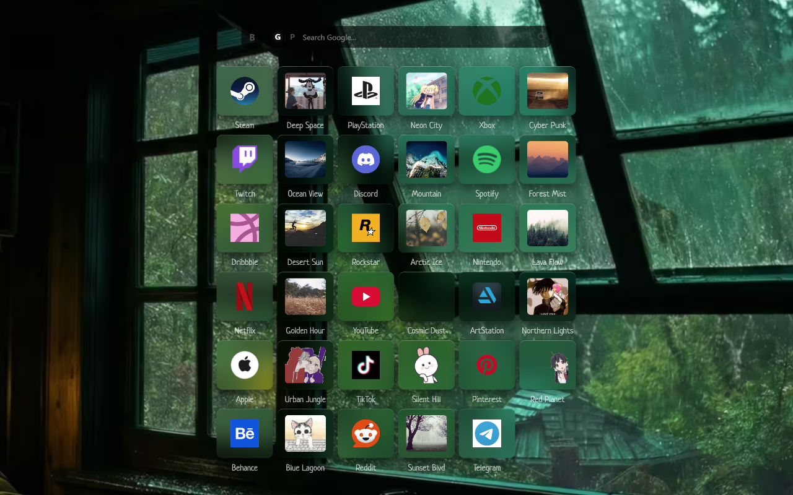
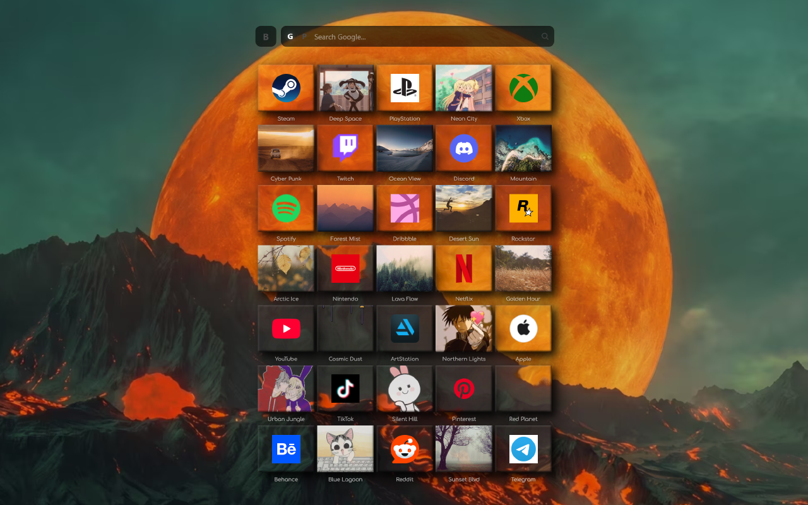
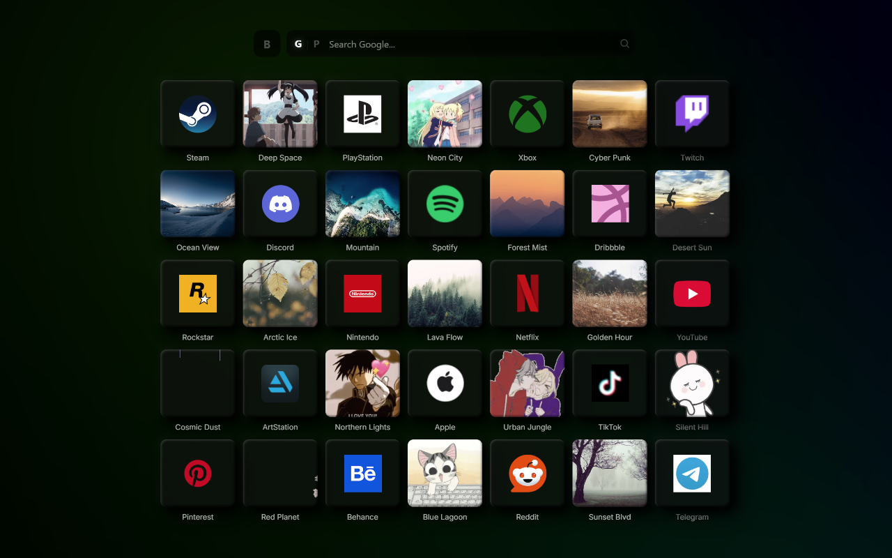
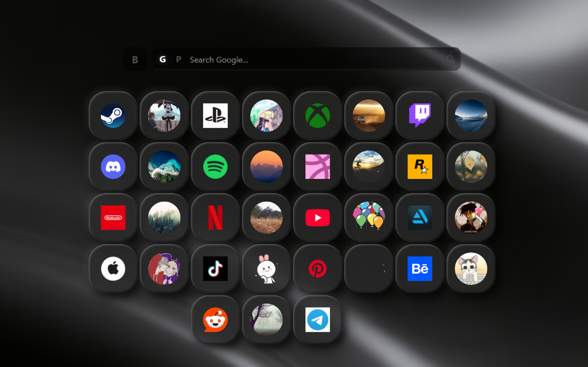
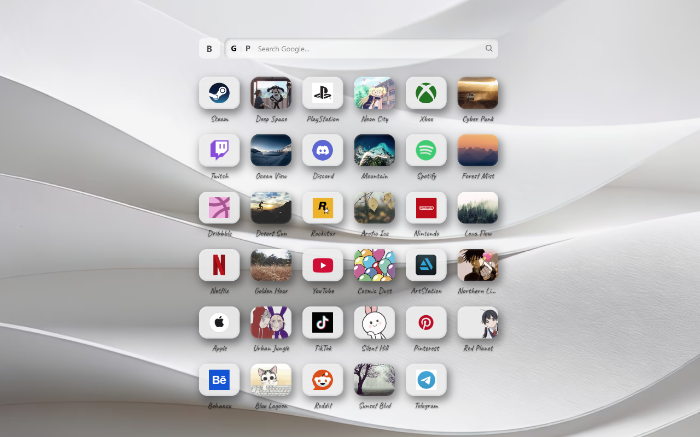
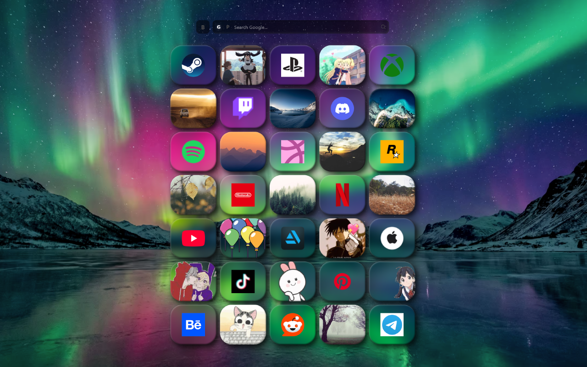
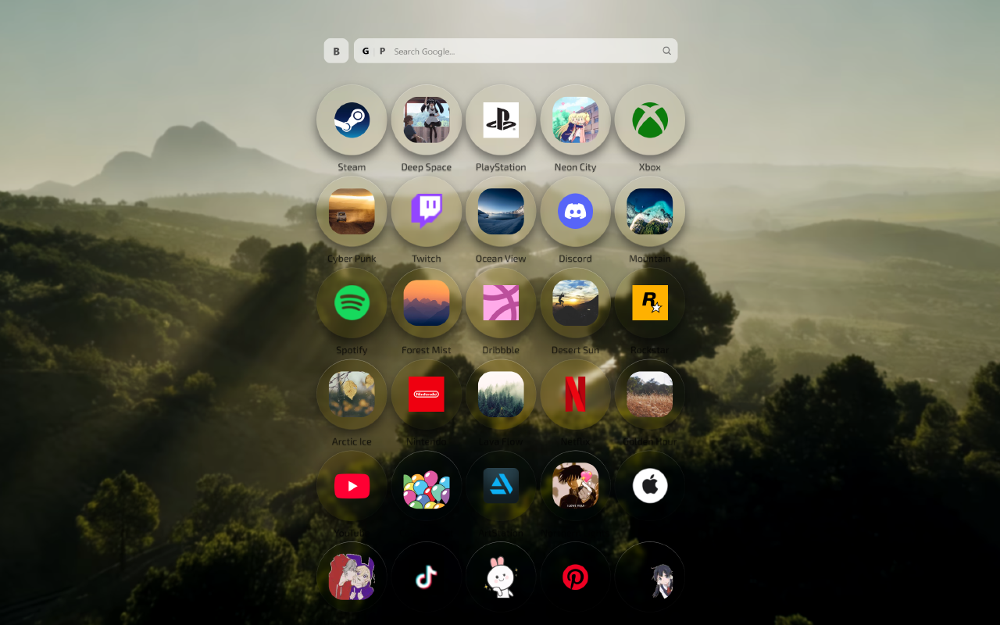
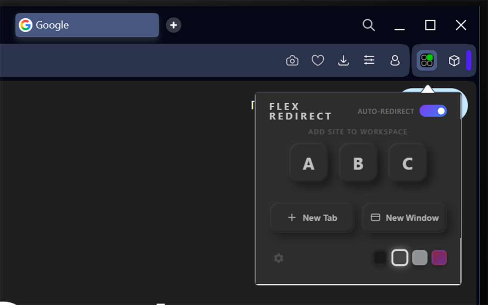
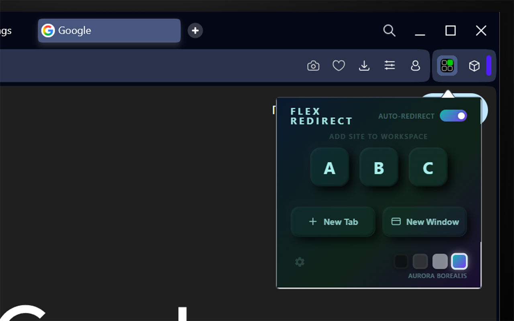